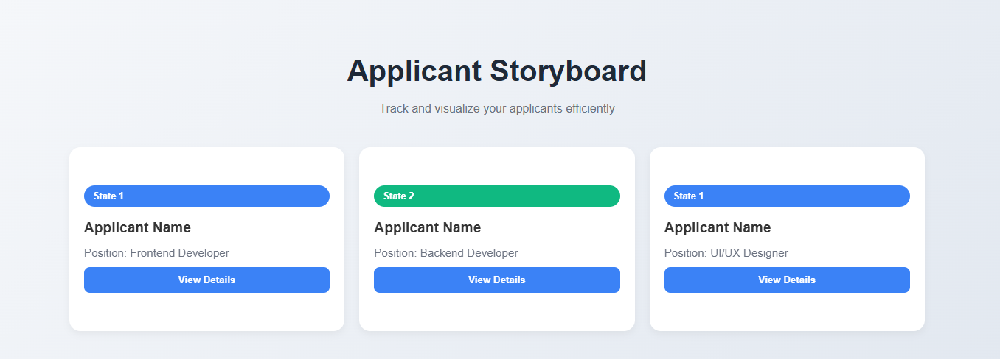

# Applicant Storyboard

A modern, interactive web application for tracking and visualizing job applicants efficiently. Features flip cards with detailed applicant information and a clean, responsive design.

## 🚀 Features

- **Interactive Flip Cards**: Click on any applicant card to reveal detailed information
- **State Management**: Visual indicators for different applicant states
- **Responsive Design**: Works seamlessly on desktop, tablet, and mobile devices
- **Modern UI**: Clean interface with smooth animations and hover effects
- **Easy Tracking**: Efficiently organize and view applicant information at a glance

## 📸 Screenshot



## 🛠️ Technologies Used

- HTML5
- CSS3 (with Grid and Flexbox)
- Vanilla JavaScript
- CSS Animations and Transitions
- Google Fonts (Inter)

## 📋 Project Structure

```
applicant-storyboard/
├── index.html          # Main HTML file
├── style.css           # Stylesheet with all styling
├── screenshot.png      # Project preview image
└── README.md          # Project documentation
```

## 🎯 Getting Started

### Prerequisites

- A modern web browser (Chrome, Firefox, Safari, Edge)
- Basic text editor (optional, for modifications)

### Installation

1. Clone or download this repository
```bash
git clone https://github.com/yourusername/applicant-storyboard.git
```

2. Navigate to the project directory
```bash
cd applicant-storyboard
```

3. Open `index.html` in your web browser
```bash
# On macOS
open index.html

# On Windows
start index.html

# On Linux
xdg-open index.html
```

### Alternative Setup

Simply download the files and double-click `index.html` to run in your default browser.

## 🎨 Customization

### Adding New Applicants

To add new applicant cards, duplicate the card structure in `index.html`:

```html
<div class="card" onclick="this.classList.toggle('flipped')">
  <div class="card-inner">
    <div class="card-front">
      <div class="card-state">State 1</div>
      <h2>Your Applicant Name</h2>
      <p>Position: Your Position</p>
      <button class="btn">View Details</button>
    </div>
    <div class="card-back">
      <p>Experience: X Years</p>
      <p>Skills: Your Skills</p>
      <p>Email: applicant@example.com</p>
    </div>
  </div>
</div>
```

### Customizing States

The project includes two predefined states:
- **State 1**: Blue badge (Default applicants)
- **State 2**: Green badge (Active/Selected applicants)

To add new states, create new CSS classes:

```css
.card.your-state .card-state {
  background-color: #your-color;
}
```

### Color Scheme

Main colors used:
- Primary Blue: `#3b82f6`
- Success Green: `#10b981`
- Background: `linear-gradient(135deg, #f5f7fa, #e2e8f0)`
- Text: `#333`, `#6b7280`

## 🔧 Browser Support

- ✅ Chrome 60+
- ✅ Firefox 55+
- ✅ Safari 12+
- ✅ Edge 79+

## 📱 Responsive Breakpoints

- **Desktop**: 1200px and above
- **Tablet**: 768px - 1199px
- **Mobile**: Below 768px

## 🤝 Contributing

1. Fork the project
2. Create your feature branch (`git checkout -b feature/AmazingFeature`)
3. Commit your changes (`git commit -m 'Add some AmazingFeature'`)
4. Push to the branch (`git push origin feature/AmazingFeature`)
5. Open a Pull Request

## 📝 Development Notes

### Key Features Implementation

- **Flip Animation**: Uses CSS `transform: rotateY()` with `preserve-3d`
- **Responsive Grid**: CSS Grid with `auto-fit` and `minmax()`
- **Smooth Interactions**: CSS transitions for hover and click effects
- **Accessibility**: Semantic HTML structure and keyboard navigation support

### Performance Considerations

- Pure CSS animations (no JavaScript animations)
- Optimized for 60fps performance
- Minimal DOM manipulation
- Efficient CSS selectors

## 🐛 Known Issues

- None currently reported

## 🔮 Future Enhancements

- [ ] Add drag-and-drop functionality
- [ ] Implement local storage for persistence
- [ ] Add search and filter capabilities
- [ ] Include export functionality
- [ ] Add more applicant states and workflows

## 📞 Support

If you encounter any issues or have questions:

1. Check existing issues on GitHub
2. Create a new issue with detailed description
3. Include browser version and steps to reproduce

## 🙏 Acknowledgments

- Design inspiration from modern dashboard interfaces
- CSS animations techniques from the web development community
- Responsive design patterns from CSS Grid and Flexbox best practices

---

**Made with ❤️ for efficient applicant tracking**
